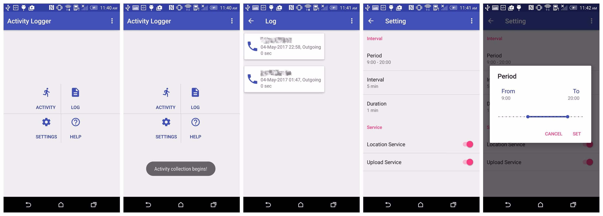
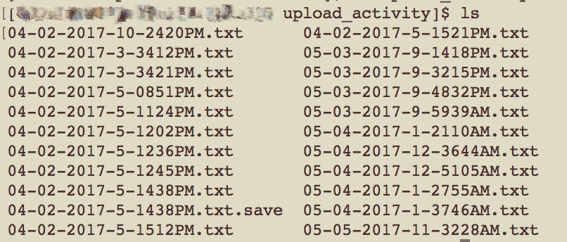

# Crowdpp2 - Activity Logger
An Android app, a new version of Crowd++ called **Activity Logger**. These serial apps of Crowdpp are aimed at autistic children, providing better caring and monitoring for their daily life when parents and doctors are not with them. By collecting children's speak percentage in conversations, their locations and their activities(including their motions, call and msg on the phone), parents and doctors can in a variety of degrees know whether their children are active indeed.

In the last version of Crowd++, we collect user's voice data and analyze the voice records to know how many people are there in a conversation. Also, to improve analysis accuracy, Crowd++ v.01 implemented location service to filter some error speaker count data; e.g., if the user is in a playground, an environment full of noise, the speaker count data may not be very dependable.
To improve analysis accuracy to a new level, we implemented [Google Activity Recognition API](https://developers.google.com/android/reference/com/google/android/gms/location/ActivityRecognitionApi) to collect user's activity motions(walk, in a car or on a bike etc) to filter more error-oriented data; e.g., if the user is riding a bike(motion) on the street(location), the speaker count data is of course not trustworthy.
Moreover, we added call&msg log so that parents and doctors can know exactly how active the kid is.

Here are some screenshots for **Activity Logger**. The whole app used [Google's Material-Design for Android](https://developer.android.com/design/material/index.html) targeting at API level 21 or above. I implemented [oli107's material-range-bar](https://github.com/oli107/material-range-bar) for choosing a period range in setting's period option. The activity data will be wrote into Android's phone storage and uploaded onto our AWS service.

